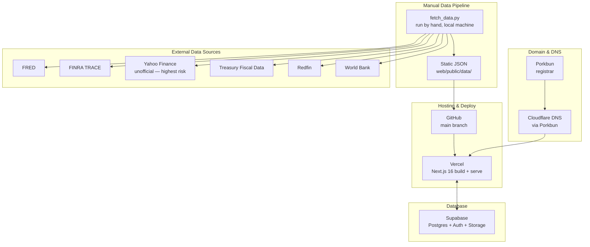
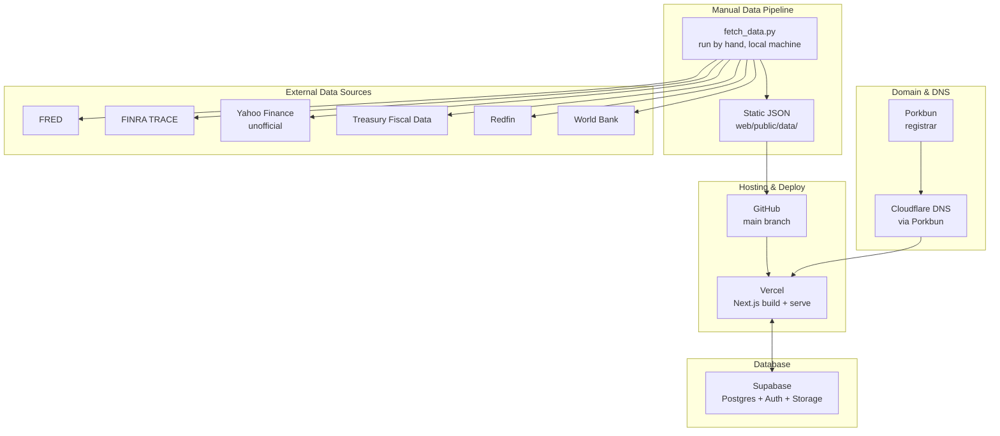

# InfinityVolume — Platform Strategy & Scaling Roadmap

*Working document. Reflects the actual stack and features built as of September 2026 — updated continuously, not a one-time artifact.*

---

## 1. Technical Infrastructure Map

### 1.1 Current stack

| Layer | Provider | What it actually does here |
|---|---|---|
| Domain registrar | Porkbun | Owns `infinityvolume.com` |
| DNS | Cloudflare (via Porkbun) | Resolves the domain — Porkbun's own DNS panel is Cloudflare-powered, not a separate service you chose independently |
| Hosting / deployment | Vercel | Builds and serves the Next.js app; auto-deploys on push to `main` via the connected GitHub repo |
| Source control | GitHub | `ambhujsharma13/ambhujsharma99` |
| Database, Auth, Storage | Supabase | Postgres (profiles, articles, channels, contacts, messages, requests, bookmarks, post_likes, role_definitions), row-level security, auth, avatar/image storage |
| Data fetching | Local Python scripts (`fetch_data.py` + modules), run manually | Pulls from every external source below, writes static JSON into `web/public/data/`, which the Next.js app reads at build/request time |
| Framework | Next.js 16 (Turbopack) | App router, server actions, server components — no separate API layer needed for most member features |

**One thing worth naming plainly**: "hosting on Vercel/Cloudflare" slightly overstates Cloudflare's role today — it's the DNS layer behind Porkbun, not a CDN or compute layer you're actively using. Vercel is the only compute/hosting provider in the stack right now.

**A second thing worth naming**: the data pipeline is currently a script you run by hand on your own machine (`python3 fetch_data.py`), not a scheduled or server-side job. Every number on the site is only as fresh as your last manual run. This works at today's scale and is fine for now, but it's a real single point of failure for freshness, and it's the first thing that needs to change before Phase 2 (see §4).

### 1.2 External data sources

| Source | What it provides | Access | Real constraints found in practice |
|---|---|---|---|
| FRED (St. Louis Fed) | Treasury yields, M2 supply, Fed balance sheet, bank credit, financial conditions index, yield curve, fed funds rate, high-yield spread, existing home sales, median home price, housing starts, building permits, international 10Y yields | Free, API key required | A handful of international-yield series (China, Brazil, Turkey) reliably 400 — not every FRED series ID resolves; each new series needs independent unit verification (a real ~1000x bug shipped once from assuming "thousands of units" when a series was actually a direct count) |
| FINRA TRACE | Treasury daily trading volume, corporate bond market breadth, corporate bond market sentiment | Free "Public" credential, OAuth2 | One dataset (`corporatesAndAgenciesCappedVolume`) needs a paid Firm/Organization credential — confirmed via a real 403; the free tier doesn't cover FINRA's full catalog |
| Yahoo Finance (unofficial `yfinance`) | Equity/ETF prices, volume, market cap, 15 international markets | Free, no key, unofficial | Not a documented, stable API — this is the single riskiest dependency in the stack at any real scale (see §4). EODHD identified as top licensed replacement candidate ($399/mo for 60+ exchanges) |
| US Treasury Fiscal Data API | Upcoming and past auction results, size, clearing yield | Free, public, no key | Genuinely reliable and well-documented; lowest-risk source in the stack |
| Redfin (public data files) | Home sales (monthly working; weekly not yet resolved) | Free, public S3 file, no key | Redfin overhauled their schema in May 2026 with no advance notice — a reminder that "free and public" doesn't mean "stable" |
| World Bank API | GDP by country | Free, public, no key | Low-maintenance, infrequent updates |

### 1.3 Dependency map

**Reading this diagram for risk**: everything to the right (the six external sources) is outside your control and free — which is exactly why it's the layer most likely to break without warning (confirmed twice: a Redfin schema change, a FINRA dataset needing a paid tier). Everything on the left (Porkbun → Cloudflare → Vercel → Supabase) is paid, contractual, and far more stable.

---

## 2. Five Functional Blocks

### Block 1 — Platform Engineering
*What you and I have been building directly.*

Database schema and RLS policies, the data-fetch pipeline, the Next.js frontend, member-area features. See `MEMBER_UTILITIES_CHECKLIST.md` for the full build log. This block is furthest ahead.

**What's been built (member platform):**
- Auth, profiles, avatar, status, public profile pages
- Publishing (articles, collaborators, tags, cover images, autosave, reading time, templates)
- Channels (public + private, invite/membership, posts, threaded replies, likes, pins, flags, hot sort)
- Requests system (channel/collaborator/contact invites — all require explicit acceptance)
- Contacts & Inbox (mutual consent model, direct messages, messaging permissions)
- Role-based system (SA/TA/RA/CA badges, admin console, permission keys, `admin_role_definitions` table)
- Omega score (5-pillar community contribution scoring — article quality, posts, likes received, article reactions, network breadth — with triggers on all contributing tables)
- Bookmarks (articles + discussion posts, `BookmarkButton` on posts and article lists, `/member/bookmarks` page)
- Navigation (7-button sidebar with icons, hover-expand on homepage, collapsible sections, Contacts / Chats)
- Homepage tables (Treasury Yields, Top ETFs by Volume, Corporate Bonds & Home Sales, Broad Financial Conditions, News Flash, Discussions preview)

**What remains in Phase 1:**
- Email + password sign-up (any email, not just Gmail) — Supabase Auth email/password provider + forgot-password reset flow. Must land before any distribution push.
- 2FA via mobile number — just before distribution goes live. US numbers: max 2 accounts per number. International: max 1 per number. Country selector auto-populates dialling code. Uniqueness enforced via DB trigger or server action. SMS via Supabase Auth's Twilio integration.
- Pinned articles on My Articles
- RA article review UI (sets `originality_score`/`admin_verified_score`, unblocks article Sigma path)
- TA flag/content review queue
- Event Calendar (new `events` + RSVP schema)
- Sentiment Polling (new `polls` + `poll_votes` schema — nav placeholder at `/member/sentiment` exists)
- Messaging end-to-end test (button exists, never tested live)

### Block 2 — Product Surface
*What users actually see and use.*

The tables, stats, news, and utilities layer — homepage market-data cards, ticker pages, watchlists, bookmarks, publishing, channels, and the major community concepts. This block answers "what does a user come here to do," as distinct from Block 1's "how is it built."

**Investor / Community Sentiment page** is now a named feature (not just a concept) — the nav item exists at `/member/sentiment` and will surface: live community polls on short/long-term direction for specific assets/sectors/market, aggregated into a proprietary Community Fear & Greed Index. This sits at the intersection of Block 1 (schema/build) and Block 2 (what users actually interact with daily).

### Block 3 — Distribution & Growth
*Getting from built to found.*

- **SEO**: keyword mapping (ticker-specific pages, "X stock volume today"-style long-tail queries, comparison pages), technical SEO (the site's server-rendered Next.js pages are already a reasonable foundation)
- **Social**: X/Twitter and Reddit finance subs are the most natural first fits; each has a different content style
- **Other channels**: newsletter/email capture, Product Hunt-style launches, community seeding in existing finance Discord/Slack communities, partnerships with finance content creators

*Not started yet — this is a Phase 2 priority.*

### Block 4 — Monetization & Unit Economics
*Direction chosen: freemium.*

Free accounts with limited utilities/channels and capped data depth; paid subscriptions for full access.

**A structural fit already built**: every homepage market-data card (Treasury Yields, Top ETFs, Corporate Bonds & Home Sales) links to a fuller landing page with more history, more columns, and interactive sorting. That "compact card is free, expanded landing page is paid" boundary is close to already built. Worth treating as the default shape for the free/paid depth boundary rather than designing a new gating mechanism from scratch.

**What's decided:**
- Free tier: limited utilities, public channels only (no private channels), capped chart/table depth
- Paid tier: full access

**Four items still open — worth resolving before building gating logic, not during:**
1. **Payment processor** — Stripe is the standard choice; not yet in the stack
2. **Full feature tier map** — Contacts/Inbox, Watchlists, Bookmarks, Publishing, Event Calendar, Sentiment Polling all need an explicit free-or-paid assignment in a single pass
3. **Pricing anchor** — a rough price point (single tier vs. multiple) before building the billing UI; ground it against actual per-user cost curve from Supabase/Vercel/API costs
4. **Existing-user policy** — current users who signed up under fully-free access need an explicit decision (grandfathered or transitioned) before the paywall goes live

### Block 5 — Trust, Legal & Operational Resilience
*Load-bearing even though it doesn't ship features.*

- **Legal basics**: Terms of Service + Privacy Policy + financial-data disclaimer (cheap now, expensive to retrofit)
- **Auth hardening**: email + password sign-up (any email, not Gmail-only) before distribution; 2FA via mobile number just before going live publicly — US numbers capped at 2 accounts, international at 1 per number; country selector auto-populates dialling code; SMS via Supabase/Twilio. Email remains the primary unique identifier (already enforced by Supabase Auth).
- **Data licensing compliance**: Yahoo Finance's unofficial API and Redfin's public files both carry real terms-of-use risk at scale
- **Operational resilience**: the site has had one full outage (missing env vars + stale DNS) — at real user volume this needs monitoring/alerting before it happens, not manual log-digging after
- **Data privacy**: user accounts, contacts, and direct messages exist — needs an explicit privacy posture (what's collected, storage, user deletion/export rights), not just RLS doing the technical enforcement

---

## 3. Three-Phase Roadmap to 100K Users

| | **Phase 1 — Foundation** | **Phase 2 — Growth** | **Phase 3 — Scale** |
|---|---|---|---|
| Rough user range | 0 → ~1,000 | ~1,000 → ~20,000 | ~20,000 → 100,000 |
| **Block 1 — Engineering** | ✅ Core member platform built. Remaining: pinned articles, RA review UI, TA moderation queue, Event Calendar, Sentiment Polling | Automate the data pipeline (scheduled job); add caching/rate-limit handling for external APIs under real load; replace Yahoo Finance unofficial API | Harden for scale: CDN strategy, database query performance, background job infrastructure |
| **Block 2 — Product Surface** | Ship remaining Phase 1 utilities; finish Event Calendar + Sentiment Polling | Round out major concepts; deepen ticker/market pages based on real usage data | Feature set matures around what Phase 2 usage data showed people actually want |
| **Block 3 — Distribution** | Not yet started — first SEO/keyword pass, decide on 1-2 initial channels | Real content cadence, measured channel performance, double down on what's working | Diversify channels; paid acquisition only if unit economics (Block 4) support it |
| **Block 4 — Monetization** | Resolve 4 open items above; build tier-gating logic + Stripe integration | Launch paid tier; validate real conversion vs. projections | Pricing/tier structure refined based on real Phase 2 conversion data |
| **Block 5 — Trust & Resilience** | ✅ Terms of service + privacy policy (placeholder). Auth hardening in Phase 1: email+password signup before distribution; 2FA via mobile number just before going live | Add uptime monitoring/alerting; formalize incident response | Full operational maturity — outages cost you users meaningfully at this scale |

---

## 4. Key Risks & Open Questions

1. **Yahoo Finance dependency.** Unofficial, undocumented, and currently the *only* source for equity/ETF prices across 15 markets — no fallback exists. EODHD identified as top licensed replacement ($399/mo, 60+ exchanges). Worth making the switch before Phase 2 traffic, not after a breakage.

2. **Manual data-fetch pipeline.** Every table on the site is only as fresh as the last terminal run. Invisible at low traffic; a real trust problem at higher traffic where "why hasn't this updated in 3 days" costs users who assumed it was live.

3. **Monetization direction is set; the specifics aren't.** Freemium is decided — the four open items in Block 4 are worth resolving before building the gating logic, not during it.

4. **Outage response is still reactive.** The full-site outage was found and diagnosed manually from Vercel's dashboard after the fact. At real user volume, "someone eventually notices and asks Claude" isn't a viable incident-response process.

5. **Omega score tier thresholds need real-usage calibration.** Current thresholds (0-39 Member, 40-69 Captain, 70-89 Quarterback, 90+ SRA) were set without real distribution data. Risk: everyone reaches Captain after a few days of activity, making the tier system meaningless. Revisit once 30+ active members have accrued scores and the distribution is visible.

6. **Role capabilities are mostly cosmetic today.** SA has real power (public channel creation enforced at RLS). RA and CA have zero distinct capabilities beyond the badge. TA has zero. The badge system exists; the permission enforcement mostly doesn't. This gap is fine at 5 users, looks incomplete at 100.

---

*Updated: September 2026. Reflects actual state of the codebase, not a forward-looking projection. Revisit §1 whenever a new data source is integrated, §2 whenever a major feature ships, and §4 before any Phase 2 work begins.*

---

## 1. Technical Infrastructure Map

### 1.1 Current stack

| Layer | Provider | What it actually does here |
|---|---|---|
| Domain registrar | Porkbun | Owns `infinityvolume.com` |
| DNS | Cloudflare (via Porkbun) | Resolves the domain — Porkbun's own DNS panel is Cloudflare-powered, not a separate service you chose independently |
| Hosting / deployment | Vercel | Builds and serves the Next.js app; auto-deploys on push to `main` via the connected GitHub repo |
| Source control | GitHub | `ambhujsharma13/ambhujsharma99` |
| Database, Auth, Storage | Supabase | Postgres (profiles, articles, channels, contacts, messages, requests), row-level security, auth, avatar/image storage |
| Data fetching | Local Python scripts (`fetch_data.py` + modules), run manually | Pulls from every external source below, writes static JSON into `web/public/data/`, which the Next.js app reads at build/request time |

**One thing worth naming plainly**: "hosting on Vercel/Cloudflare" slightly overstates Cloudflare's role today — it's the DNS layer behind Porkbun, not a CDN or compute layer you're actively using. Vercel is the only compute/hosting provider in the stack right now.

**A second thing worth naming**: the data pipeline is currently a script you run by hand on your own machine (`python3 fetch_data.py`), not a scheduled or server-side job. Every number on the site is only as fresh as your last manual run. This works at today's scale and is fine for now, but it's a real single point of failure for freshness, and it's the first thing that needs to change before Phase 2 (see §4).

### 1.2 External data sources

| Source | What it provides | Access | Real constraints found in practice |
|---|---|---|---|
| FRED (St. Louis Fed) | Treasury yields, M2 supply, Fed balance sheet, bank credit, financial conditions index, yield curve, fed funds rate, high-yield spread, existing home sales, median home price, housing starts, building permits, international 10Y yields | Free, API key required | A handful of international-yield series (China, Brazil, Turkey) reliably 400 — not every FRED series ID resolves; each new series needs independent unit verification (a real ~1000x bug shipped once from assuming "thousands of units" when a series was actually a direct count) |
| FINRA TRACE | Treasury daily trading volume, corporate bond market breadth, corporate bond market sentiment | Free "Public" credential, OAuth2 | One dataset (`corporatesAndAgenciesCappedVolume`) needs a paid Firm/Organization credential — confirmed via a real 403; the free tier doesn't cover FINRA's full catalog |
| Yahoo Finance (unofficial `yfinance`) | Equity/ETF prices, volume, market cap, 15 international markets | Free, no key, unofficial | Not a documented, stable API — this is the single riskiest dependency in the stack at any real scale (see §4) |
| US Treasury Fiscal Data API | Upcoming and past auction results, size, clearing yield | Free, public, no key | Genuinely reliable and well-documented; lowest-risk source in the stack |
| Redfin (public data files) | Home sales (monthly working; weekly not yet resolved) | Free, public S3 file, no key | Redfin overhauled their schema in May 2026 with no advance notice — a reminder that "free and public" doesn't mean "stable" |
| World Bank API | GDP by country | Free, public, no key | Low-maintenance, infrequent updates |

**A note on completeness**: this table reflects data sources I've directly worked with and confirmed in this build. If a news data provider (NewsData.io or similar) is integrated elsewhere in the codebase — the homepage's "News Flash" widget has shown as a "coming soon" placeholder in every session I've seen it, not wired to a live source — it's worth adding to this table once confirmed, rather than assumed here.

### 1.3 Dependency map

**Reading this diagram for risk, not just structure**: everything to the right (the six external sources) is outside your control and free — which is exactly why it's the layer most likely to break without warning (confirmed twice already this session: a Redfin schema change, a FINRA dataset needing a paid tier). Everything on the left (Porkbun → Cloudflare → Vercel → Supabase) is paid, contractual, and far more stable — the one outage you had there was a configuration gap (missing env vars, a stale DNS record), not a provider failure.

---

## 2. Five Functional Blocks

You named three; two more are worth adding for a platform that handles financial data and user accounts at real scale.

### Block 1 — Platform Engineering
*What you and I have been building directly.*

Database schema and RLS policies, the data-fetch pipeline, the Next.js frontend, member-area features (channels, requests, contacts/inbox, publishing), homepage market-data tables. This is the block with the most concrete, shippable progress so far — see `MEMBER_UTILITIES_CHECKLIST.md` for the detailed build log.

### Block 2 — Product Surface
*What a product manager would define: what users actually see and use.*

The tables, stats, news, and utilities layer — homepage market-data cards, ticker pages, the Corporate Bonds & Home Sales landing page, watchlists, bookmarks, the four "major concepts" (Mastermind Registry, Event Calendar, Sentiment Polling, and Contacts/Inbox — the last one done). This block answers "what does a user come here to do," as distinct from Block 1's "how is it built."

### Block 3 — Distribution & Growth
*Getting from built to found.*

- **SEO**: keyword mapping (ticker-specific pages, "X stock volume today"-style long-tail queries, comparison pages), technical SEO (the site's server-rendered Next.js pages are already a reasonable foundation for this), content strategy for pages that rank
- **Social**: which platforms fit a market-data/finance-community audience (X/Twitter and Reddit's finance subs are the most likely first fits; each has a very different content style)
- **Other channels**: newsletter/email capture, Product Hunt-style launches, community seeding in existing finance Discord/Slack communities, partnerships with finance content creators

### Block 4 — Monetization & Unit Economics
*Direction chosen: freemium — free accounts with limited utilities/channels (no private channels) and limited depth behind homepage charts; paid subscriptions for full access.*

**A structural fit worth naming**: the site already has a pattern that maps almost exactly onto this — every homepage market-data card (Treasury Yields, Top ETFs, Corporate Bonds & Home Sales) links to a fuller `/[topic]` landing page with more history, more columns, and interactive sorting. That "compact card is free, expanded landing page is paid" boundary is close to already built, not a new architecture to invent. Worth treating as the default shape for "limited depth behind homepage charts" rather than designing a separate gating mechanism from scratch.

**What's decided:**
- Free tier: limited utilities, public channels only (no private channels), capped chart/table depth
- Paid tier: full access

**What's still open, worth deciding before this gets built rather than mid-build:**
- **Payment processing.** Not yet in the stack — Stripe is the standard choice for subscription billing and would need its own line in the infrastructure map (§1.1) once chosen.
- **A full feature-by-feature tier map.** Two gates are named (private channels, chart depth) — but Contacts/Inbox, Watchlists, Bookmarks, Publishing, and the four "major concepts" all still need an explicit free-or-paid assignment. Worth a single tier-mapping pass across every Block 2 feature rather than deciding gate-by-gate as each one ships.
- **Pricing.** Not yet named, and doesn't need to be today — but worth at least a rough anchor (a single price point vs. multiple tiers) before building the billing flow, since that choice shapes the UI. Grounding it in real cost data helps: Supabase, Vercel, and FRED/FINRA's rate limits all step up in cost or hit hard walls with real traffic, so the paid tier's price is more defensible set against an actual per-user cost curve than picked in isolation.
- **Existing users.** Once a paywall exists, current users who signed up under fully-free access need an explicit decision — grandfathered in free, or transitioned — rather than an accidental one made by however the billing code happens to handle it.

This is now a concrete enough direction to scope as real Block 1 engineering work (tier-gating logic, a subscription table in Supabase, Stripe integration) rather than an open strategic question — but the four items above are worth resolving before that build starts, not during it.

### Block 5 — Trust, Legal & Operational Resilience
*Also not named, also load-bearing — especially for a platform handling financial data and user accounts.*

- **Legal basics**: Terms of Service, Privacy Policy, a financial-data disclaimer (this is market data and community discussion, not investment advice — worth being explicit about that distinction somewhere users will see it)
- **Data licensing compliance**: Yahoo Finance's unofficial API and Redfin's public files both carry real terms-of-use risk at scale that doesn't exist at hobbyist volume — worth a look before Phase 2 traffic, not after
- **Operational resilience**: the site has already had one full outage this session (missing env vars + a stale DNS record) — at 100K users, that kind of incident needs monitoring/alerting in place *before* it happens, not diagnosed after the fact via manual log-digging in Vercel's dashboard
- **Data privacy**: user accounts, contacts, and direct messages already exist — at real scale this needs an explicit privacy posture (what's collected, how it's stored, user deletion/export rights), not just RLS policies doing the technical enforcement

---

## 3. Three-Phase Roadmap to 100K Users

| | **Phase 1 — Foundation** | **Phase 2 — Growth** | **Phase 3 — Scale** |
|---|---|---|---|
| Rough user range | 0 → ~1,000 | ~1,000 → ~20,000 | ~20,000 → 100,000 |
| **Block 1 — Engineering** | Current state: manual data pipeline, core member features, homepage tables | Automate the data pipeline (scheduled job, not manual runs); add caching/rate-limit handling for external APIs under real load | Harden for scale: CDN caching strategy, database query performance, background job infrastructure if the pipeline outgrows a single script |
| **Block 2 — Product Surface** | Ship the remaining Phase-1 member utilities (bookmarks, pinned articles, profile preview); finish 1-2 of the four major concepts | Round out the major concepts (Mastermind Registry, Event Calendar, Sentiment Polling); deepen ticker/market pages based on real usage data | Feature set matures around what Phase 2 usage data actually showed people want, not more speculative building |
| **Block 3 — Distribution** | Not yet started — first SEO/keyword pass, decide on 1-2 initial channels | Real content cadence, measured channel performance, double down on whatever's working | Diversify channels so no single one is a point of failure; paid acquisition only if unit economics (Block 4) support it |
| **Block 4 — Monetization** | Resolve the four open items above (payment processor, full tier map, pricing anchor, existing-user policy); build tier-gating logic and Stripe integration | Launch paid tier; validate real conversion and unit economics against actual usage, not projections | Pricing/tier structure refined based on real Phase 2 conversion data, not the original guess |
| **Block 5 — Trust & Resilience** | Terms of Service + Privacy Policy + basic disclaimer (cheap now, expensive to retrofit); review data-source licensing terms | Add uptime monitoring/alerting; formalize an incident response habit | Full operational maturity — this is where an outage actually costs you meaningfully in users, not just inconvenience |

**Why this order**: Block 5 looks like it can wait, and mostly can — but it has a cheap-now/expensive-later shape. A Terms of Service page costs an afternoon in Phase 1; retrofitting legal coverage after 20,000 users have signed up under none is a much bigger problem. Same logic for monitoring: instrumenting it before an incident is trivial; reconstructing what happened after one, from scratch, in Vercel's log UI, is the exact debugging session we just went through together. Block 4 has moved out of "can wait" now that the direction is chosen — the open items in §2 are worth resolving in Phase 1 specifically so the tier-gating logic gets built once, correctly, rather than retrofitted after Phase 2 users are already active on features that need re-gating.

---

## 4. Key Risks & Open Questions

Worth deciding on deliberately rather than discovering by accident:

1. **Yahoo Finance dependency.** This is unofficial, undocumented, and the least stable source in the stack. It's also currently the *only* source for equity/ETF prices across 15 markets — there's no fallback. Worth researching a licensed alternative (even a paid one) before this becomes a Phase-2 blocker rather than a Phase-1 convenience.
2. **The manual data-fetch habit.** Every table on the site is exactly as fresh as your last terminal run. This is invisible at low traffic and becomes a real trust problem at higher traffic, where "why hasn't this updated in 3 days" starts costing you users who assumed it was live.
3. **Monetization direction is set; the specifics aren't yet.** Freemium (free tier with limited channels/depth, paid for full access) is decided — see Block 4 above for the four concrete items (payment processor, full feature tier map, pricing anchor, existing-user policy) worth resolving before building the gating logic, not during it.
4. **Outage response was reactive, not instrumented.** The recent full-site outage was found and diagnosed by manually reading Vercel's dashboard after the fact. At 100K users, "someone eventually notices and asks Claude to look into it" isn't a viable incident-response process.

---

*This document reflects the stack, feature set, and open items as of the September 2026 build sessions. Worth revisiting as a living document rather than a one-time artifact — the technical picture in particular will look different once Block 1's automated pipeline work lands.*
